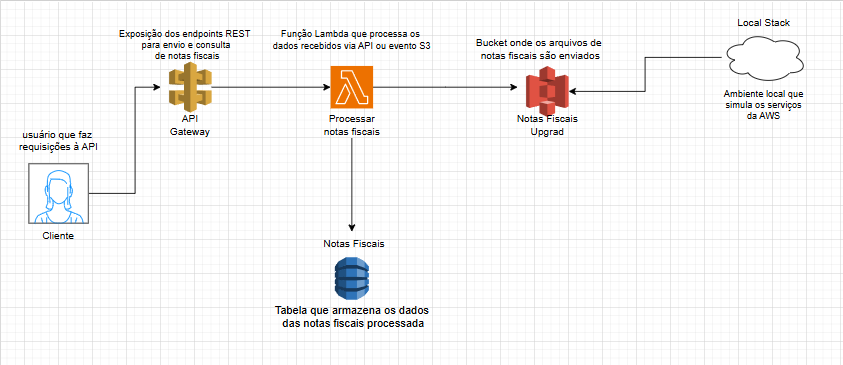

# Processamento de Notas Fiscais com AWS LocalStack 📃

Este projeto foi desenvolvido como parte do curso **Executando Tarefas Automatizadas com Lambda Function e S3**, oferecido pela **DIO (Digital Innovation One)** em parceria com a **Santander Academy Open**.

A proposta é simular o processamento de notas fiscais em ambiente local utilizando serviços da AWS via LocalStack e Docker.

## Conhecimentos aplicados

Durante o desenvolvimento deste projeto, foram aplicados e consolidados os seguintes conhecimentos:

- Criação de funções Lambda para automação de tarefas
- Configuração de gatilhos com Amazon S3 para execução de processos
- Integração de API Gateway com Lambda e DynamoDB
- Simulação de serviços AWS localmente com LocalStack
- Manipulação de dados em buckets S3 e tabelas DynamoDB
- Uso de Docker para orquestração de ambiente de desenvolvimento
- Boas práticas em arquitetura serverless e cloud computin

## Arquitetura

- **Cliente**: envia requisições para a API.
- **API Gateway**: expõe endpoints REST para envio e consulta de notas fiscais.
- **Lambda**: processa os dados recebidos e envia os arquivos para o bucket S3.
- **S3 (Notas Fiscais Upload)**: armazena os arquivos processados.
- **DynamoDB (Notas Fiscais)**: registra os dados estruturados das notas.
- **LocalStack**: simula os serviços AWS localmente para desenvolvimento e testes.

## Tecnologias

- Docker
- LocalStack
- AWS SDK
- API Gateway (simulado)
- Lambda
- S3
- DynamoDB

## Como executar

1. Clone o repositório
2. Suba o ambiente com Docker:
docker-compose up
3. Envie requisições para os endpoints da API simulada
4. Verifique os dados no bucket S3 e na tabela DynamoDB local

## Requisitos

- Docker instalado
- AWS CLI (opcional para testes manuais)
- Node.js ou Python (dependendo da linguagem usada no Lambda)

 © Projeto educacional DIO + Santander Academy Open
 ## Diagrama da Arquitetura

